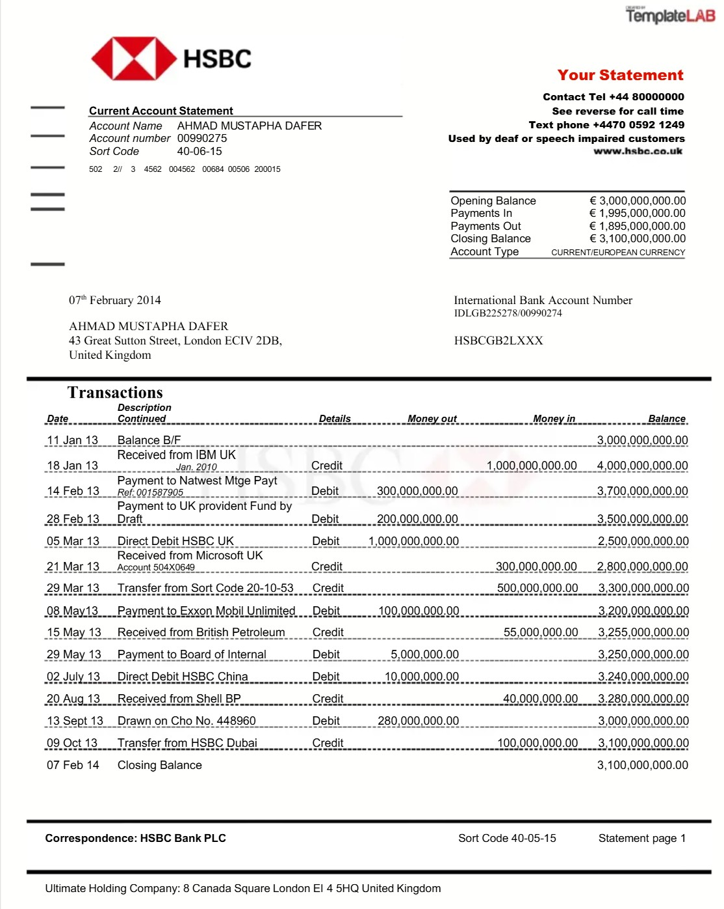

# HSBC UK PDF statement converter (local-only)

Convert an HSBC UK personal account statement PDF (downloaded manually) into a normalized list of transactions.

## Security

- No credentials required.
- Processing is entirely local.
- The extractor ignores statement header data (name/address/account details) and only emits transaction rows.

## Requirements

- Python 3.11+
- `pdfplumber` for PDF text extraction

Install dependencies:

```bash
python -m pip install -r requirements.txt
```

## Usage

```bash
python -m scripts.hsbc_pdf_to_txn --pdf StatementsPDF/2026-01-10_Statement.pdf
```

Flags:

- `--pdf` — path to the HSBC statement PDF (required)
- `--outdir` — directory for all output files (default `finance/exports`)
- `--account-id` — account identifier (default `HSBC_UK`)
- `--extractor` — PDF extraction method: `words` (default) or `text`. The `words` extractor groups pdfplumber word objects by Y coordinate for better column alignment; falls back to `text` automatically if `words` yields no lines.

Outputs (same basename, written under `--outdir`):

- `{basename}_transactions.csv` — normalized transactions
- `{basename}_transactions.json` — same data in JSON
- `{basename}_warnings.txt` — lines that could not be parsed
- `{basename}_suspects.csv` — transactions flagged for QA review
- `{basename}_suspects_context.txt` — raw PDF lines around each suspect
- `{basename}_running_balance_walk.csv` — per-transaction running balance walk comparing computed balance to PDF balance. Includes `balance_row_ref` (the actual line where the balance token was found, which may differ from the transaction start line)
- `{basename}_extractor_diagnostics.csv` — word-extractor metrics (lines per page, token histogram, suspect merged lines)

Additional debug exports (only written when reconciliation diffs are non-zero):

- `{basename}_unmatched_amount_lines.csv`
- `{basename}_keyword_lines.csv`
- `{basename}_used_non_txn_amount_lines.csv`
- `{basename}_balance_recon_gaps.csv`
- `{basename}_balance_delta_mismatches.csv`
- `{basename}_nonprefix_continuation_txns.csv`

## QA workflow (recommended)

1. Run the converter and review the stdout summary:

   - `candidate_date_lines_in_pdf` / `transaction_count`
   - `total_credits` / `total_debits` / `net`
   - `diff_credits_vs_statement_in` / `diff_debits_vs_statement_out` / `diff_txn_delta_vs_statement_delta` — all should be `0.00`
   - `any_parse_warnings_count` / `suspects_count`
   - `extractor_suspect_merged_line_count` — non-zero indicates possible column mis-merge in the word extractor
   - Full extractor diagnostics (lines per page, token histogram) are also printed to stdout when using the `words` extractor

2. If `any_parse_warnings_count > 0`, open `{basename}_warnings.txt`.

3. If `suspects_count > 0`, open:

   - `{basename}_suspects.csv` for the flagged transactions + reasons
   - `{basename}_suspects_context.txt` to see the raw PDF text lines around each suspect’s `row_ref`

4. If the statement contains totals like `Payments In` / `Payments Out`, the converter will print them (and the difference vs parsed totals) to help reconciliation.

## Normalized output schema

- `source_file`
- `account_id`
- `txn_date` (ISO `YYYY-MM-DD`)
- `description_raw`
- `amount` (expenses negative, income positive)
- `currency` (defaults to `GBP` in v1)
- `page` (1-based)
- `row_ref` (stable reference like `{page}:{line_index}`)

## Supported HSBC statement formats (v1)



This converter targets HSBC UK *text-based* PDFs where transaction tables appear as lines containing:

- Date (e.g. `01 Jan 26` or `01/01/26`)
- Description (may wrap onto following lines)
- `Money Out` / `Money In` (and sometimes `Balance`)

Notes:

- Wrapped descriptions are joined to the previous transaction row.
- Amount parsing supports commas, optional `£`, trailing minus, and parentheses.
- Balance marker lines (`BALANCE BROUGHT FORWARD`, `BALANCE CARRIED FORWARD`, `OPENING BALANCE`, `CLOSING BALANCE`) are automatically excluded from transactions and used only for reconciliation.
- Deduplication is by `row_ref` (`page:line_index`) only. Legitimate repeated transactions on different lines are preserved.
- Recognised transaction prefixes: `DD`, `VIS`, `BP`, `CR`, `SO`, `ATM`, `DR`, `FPI`, `FPO`, `TFR`, `TRF`, `BGC`, `CHG`, `CHARGE`, `CASH`, `DEP`, `POS`, `CARD`, `OBP`, `)))`.
- **Foreign currency transactions** — lines matching the FX conversion pattern (`USD 24.00 @ 1.25…`) are treated as description-only; the GBP-equivalent amount is taken from the subsequent `Visa Rate` line instead. A look-ahead checks for `DR Non-Sterling` / `CR Non-Sterling` to determine debit vs credit direction.
- When a transaction line has no explicit balance column (single money token), the running balance is updated synthetically (`last_balance += amount`) so that subsequent balance-delta sign inference remains accurate.

## Troubleshooting

- If you see:

  `Extraction likely failed (PDF may be scanned/image-based). OCR not implemented in v1.`

  the PDF likely contains images rather than selectable text. OCR is intentionally not implemented in this version.

- Check `{basename}_warnings.txt` for any lines that looked like transactions but could not be parsed.

## Running tests

```bash
python -m unittest discover -s tests -v
```

## Batch statement testing

To run all PDFs in `StatementsPDF/` through the parser and check reconciliation:

```bash
python run_all_statements.py
```

Reports `PASS`/`FAIL` per statement and a final summary. A statement passes when `diff_credits`, `diff_debits`, and `diff_delta` are all within tolerance of zero.
